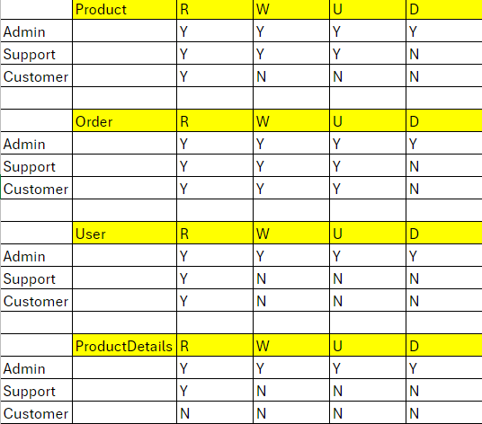

# Overview 
Advanced Order Management System 
## Tech stack:
-  **Frontend**: html
-  **Backend**: Node.js, ExpressJS, Mongoose, Socket.IO, JWT, bcrypt
-  **Database**: MongoDB

## Deployment
-  Please run "npm install" command from root directory of the project after cloning the project from github.
    For example if the project is under c:\Joy Group , cd c:\Joy Group, npm install
-  Please create a mongodb database joy_db on your local machine.
-  You can access database using this connection string: 
[mongodb://127.0.0.1/joy_db]
-  Database can be repopulated using exported JSON files in /database folder
-  Once everything is ready, pls run "node app.js"

# Application
## Assumption
I assumed that i do not need to implement for Front-end pages. I only create one simple html under htmls folder that admin and support can view the live new orders that coming in. and for testing purpose, i didn't filter with token. 
The page will get updat every new order created or updated. please create/update orders from post man
please access and view live orders from this link
["http://localhost:5000/orders/view/"]

##Source code structure
-  Back-end
    -  **routes/xxx.controllers.js**: communicate with database and expose data/functionality to frontend via JSON RESTful web service.

## Data model
Database includes four following collections:
-  Users: contains information for all users
-  Products: contains information for all product type
-  ProductDetails: contains information for all product and their inventory type
-  Orders: contains information for all orders

# Main Features

## 0) Node JS and Express JS
- Proper use of Express.js and Node.js for efficient routing and handling requests. 

## 1) User Authentication and Authorization
- Implemented role-based authentication with multiple user roles (customer, admin, support). authenticate using expressJWT for JWT token and authorize based on user role.

Admin: Users with administrative privileges, often have access to all features and can perform administrative tasks.
Customer: Standard users who have access to basic features and functionalities like viewing products and place orders.
Support: Users with elevated privileges, often responsible for moderating orders or managing products.

R = Read, W = Write/Create , U = Update , D = Delete

## 2) Advanced Database Design
- store and retrieve users, orders, products, customers, and related data. 
- Added index to username field for faster user searching and productid field in productdetails for the same.
- Implemented mongodb transaction feature, so that only if both transactions are succeeds, then commit all the transactions

## 3) Inventory Management
- Once the new order request is issued system will check the current inventory and will show error "Insuficient Product Quantity" if order quantity is more than stock balance. and update the balance once the order is confirmed.

## 4) Security Measures
- user password are encrypted/decrypted using bcrypt, signed with secret key and stored in database.
- using Role-Based Authentication to minimizes the risk of unauthorized access or actions within the application, reducing security vulnerabilities.
- use JWT token to block unauthorize access and authorize users based on roles.
- Data Validation to validate user inputs to prevent security vulnerabilities like SQL injection, XSS attacks (this not implemented yet)

## 5)Real-Time Order Tracking using Socket.IO
- All new orders / updated orders from postman request will be display in orderview.html
- Customers and support staff should be able to view the live status of orders with status.
Admin, Staff ["http://localhost:5000/orders/view/"]
Customer ["http://localhost:5000/orders/view/customer/"]